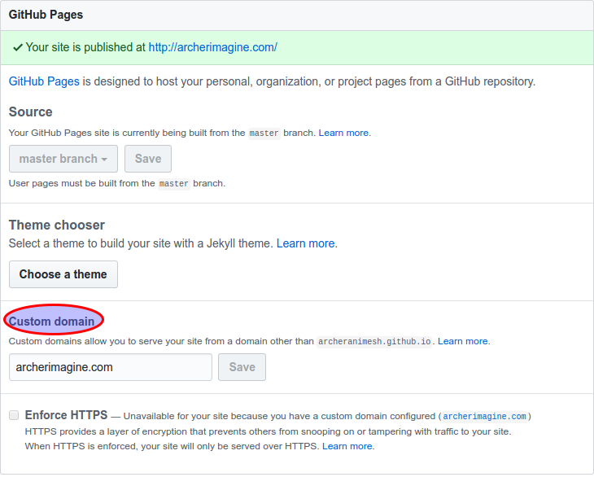

# Configuring Github pages with godaddy domain #

I have mentioned some of the links in references, have visited all of the below and few more, but the configuration is much simpler.

The process can be broken into 2 broad steps.
1. Configure your Github repo
2. Configure the DNS at [GoDaddy](https://in.godaddy.com/)

## Configure your Github repo ##

The prequsite is that we have a github pages of like this [archeranimesh.github.io](archeranimesh.github.io), if not kindly visit this [link](https://pages.github.com/) for generating one.

The first thing we would like to do is to configure a CNAME in the above repo.

There are two ways to do this.

1. Local Repo
2. Directly on Github.

### Local Repo ###

1. Create a local file in the repo with the name CNAME.
2. Just have one line in the file. `example.com`, where `example.com` is your domain you have bought from [GoDaddy](https://in.godaddy.com/).
3. Push the changes to [Github](https://github.com/)

### Directly on GitHub ###

On the repository in [Github](https://github.com/), you will see something like this.

In the above Click on the `Settings`, Scroll down you will see something like this.

Enter the domain you have purchased from [GoDaddy](https://in.godaddy.com/).

These are the only changes required to be done in GitHub.

## Configure the DNS at [GoDaddy](https://in.godaddy.com/) ##

## References ##

1. [Setting Up a GoDaddy Domain Name With GitHub](http://www.mycowsworld.com/blog/2015/07/12/setting-up-a-godaddy-domain-name-with-github/)
2. [Configuring a Godaddy domain name with github pages](http://andrewsturges.com/blog/jekyll/tutorial/2014/11/06/github-and-godaddy.html)
3. [Using a custom domain with GitHub Pages](https://help.github.com/articles/using-a-custom-domain-with-github-pages/)
4. [Using GitHub Pages To Host Your Website](http://blog.teamtreehouse.com/using-github-pages-to-host-your-website)
