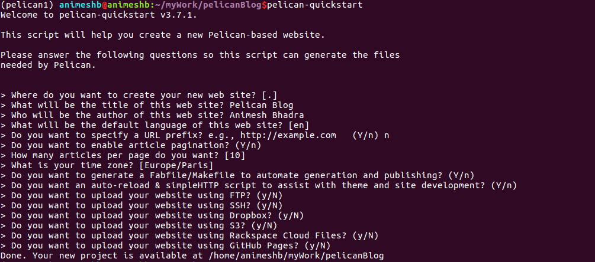
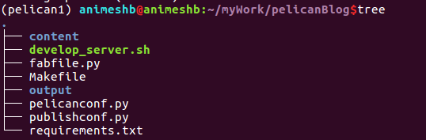
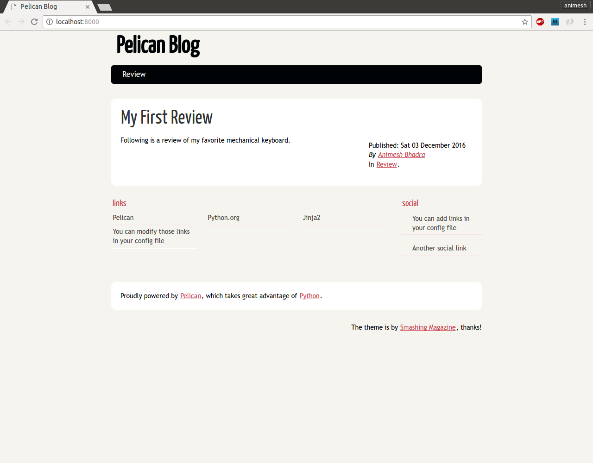

# How to Setup Pelican Blog #

### Installation of Pelican ###

I am follwing the process mentioned in this [blog](http://marpat.github.io/python-anaconda-and-pelican-on-windows.html)

1. conda create -n pelican1 python=2
2. The output looks like this


3. source activate pelican1
4. conda list

5. pip install pelican
6. conda list


7. enable markdown support, by downloading this packages.  
    a. pip install markdown
8. Create a project folder, and execute this command.  
    a. pip freeze > requirements.txt  
    b. the above command will freeze the packages installed.  
9. The first command to create a pelican blog is very simple.  
    a. pelican-quickstart



10. After running the above command execute this command,
    11. tree.
12. The output will look like this.



13. Create some content inside the "content" folder shown in the Tree commnd output.
14. /home/animeshb/myWork/pelicanBlog/content/keyboard-review.md

```
Title: My First Review
Date: 2010-12-03 10:20
Category: Review

Following is a review of my favorite mechanical keyboard.
```

15. Generate the site
16. pelican content
17. The site is generated in the output folder.
18. preview the site.
19. cd ~/projects/yoursite/output
20. python -m pelican.server
21. http://localhost:8000/ 
22. This will look like this.



## References ##

1. [Blogging with Python, Anaconda, and Pelican on Windows](http://marpat.github.io/python-anaconda-and-pelican-on-windows.html)
2. [Pelican Doc](http://docs.getpelican.com/en/stable/quickstart.html)
3. [Source Code of My Blog.](https://github.com/archeranimesh/pelicanBlog)
