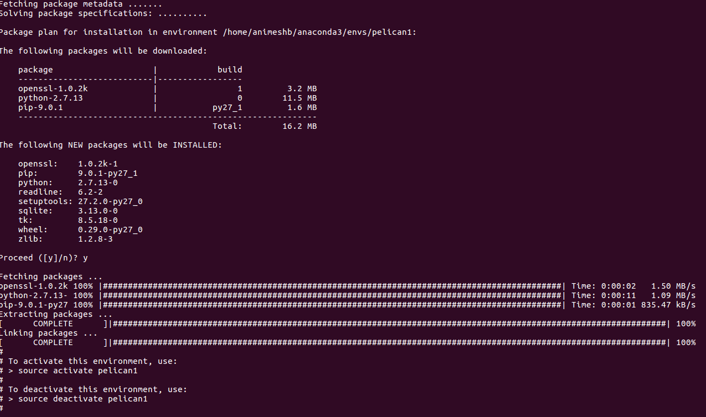

# How to Setup Pelican Blog #

### Installation of Pelican ###

I am follwing the process mentioned in this [blog](http://marpat.github.io/python-anaconda-and-pelican-on-windows.html)

1. conda create -n pelican1 python=2
2. The output looks like this

3. source activate pelican1
4. conda list

5. pip install pelican
6. conda list

## References ##

1. [Blogging with Python, Anaconda, and Pelican on Windows](http://marpat.github.io/python-anaconda-and-pelican-on-windows.html)
